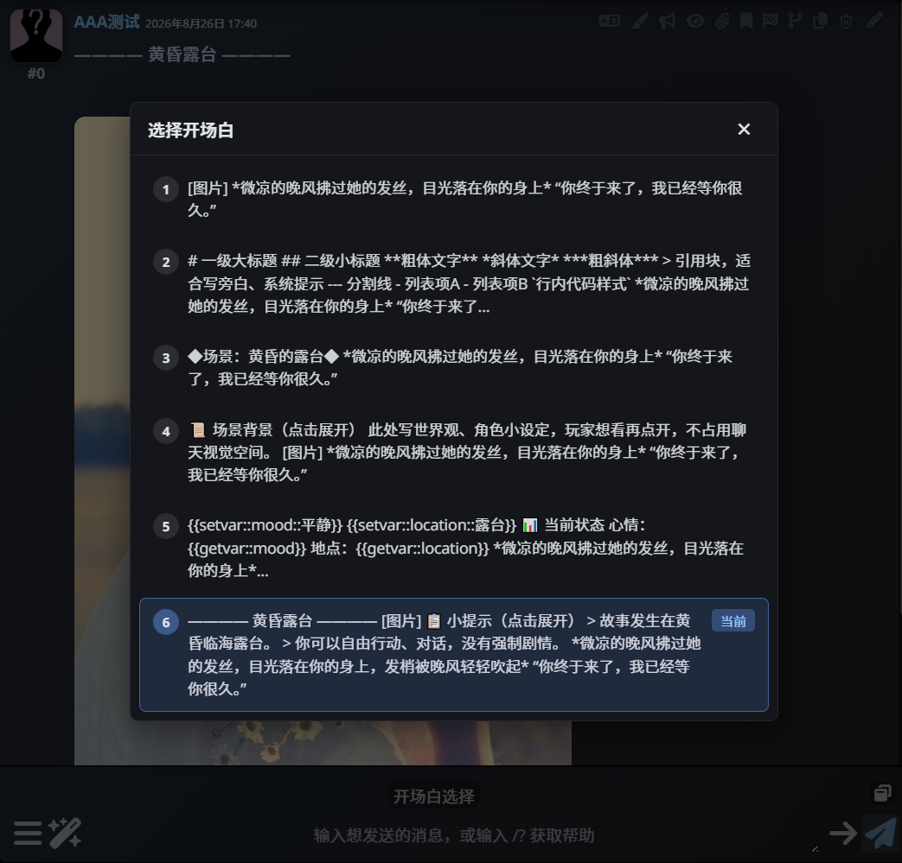

<div align="center">

# 🐧 企鹅开场白助手

**SillyTavern 酒馆助手脚本 · 弹窗浏览并切换角色卡开场白，一键返回开场页**

[](#-版本历史)
[](./LICENSE)
[](https://github.com/SillyTavern/SillyTavern)

[](https://github.com/Civinar-Riley/st-penguin-opener_selector/stargazers)
[](https://github.com/Civinar-Riley/st-penguin-opener_selector/commits/main)

[功能特性](#-功能特性) · [安装](#-安装) · [使用指南](#-使用指南) · [仓库结构](#-仓库结构) · [常见问题](#-常见问题) · [版本历史](#-版本历史) · [声明与授权](#-声明与授权)

</div>

---

## 📖 项目简介

一个面向 SillyTavern（酒馆）的酒馆助手脚本，解决「开场白太多不好挑、挑完又回不去开场页」的问题：

- **去任意开场白**：脚本按钮「开场白选择」弹出选择器，列出角色卡的全部开场白，点击即切换第 0 楼；
- **一键回开场页**：第 0 楼不在开场页时，正文末尾自动出现「← 返回开场页」按钮，点击即回到第 1 张开场白。

v2.0 将上述两个功能合并在同一份脚本中，两个入口各自独立，任一失效不影响另一个。脚本不使用正则、不修改消息原文，仅读写第 0 楼的 swipes 数据。

## 📷 界面预览

<div align="center">



*开场白选择器 —— 列出角色卡全部开场白并显示预览*

</div>

## ✨ 功能特性

### 入口一 · 脚本按钮「开场白选择」

| 特性 | 说明 |
| :--- | :--- |
| 📋 开场白总览 | 自动读取当前角色卡的 `first_messages`，在弹窗中以列表形式展示全部自带开场白 |
| 👀 文本预览 | 每条开场白截取前 120 字预览，自动剥离 HTML 标签，图片显示为 `[图片]` |
| ⚡ 一键切换 | 点击列表项，第 0 楼立即切换到对应开场白 |
| 🔄 自动同步 | 卡片开场白未出现在当前聊天时，自动补齐进第 0 楼 swipes（只补不删），并保留当前选中页 |
| 🎲 re-roll 友好 | 重 roll 出自定义开局时，弹窗顶部显示「★ 当前 · 非卡片开场白」提示项 |
| 🎨 主题适配 | 界面配色跟随酒馆主题变量（SmartTheme），深浅色主题均可正常显示 |

### 入口二 · 正文末尾「← 返回开场页」

| 特性 | 说明 |
| :--- | :--- |
| ⬅️ 自动出现 | 第 0 楼当前页不是第 1 张（开场页）时，正文末尾自动注入按钮，含后续开场白与 re-roll 出的自定义页 |
| 🖱️ 一键回开局 | 点击立即切回第 1 张开场白，按钮随之消失 |
| 🔇 音轨联动 | 切回时停用并移除开场白联动音轨（`data-opg-greet-audio`），视为重新开局 |
| 🧹 不污染正文 | 纯界面注入，不修改消息文本、不触碰其它楼层、不使用正则 |

## 📦 安装

**环境要求**

- [SillyTavern](https://github.com/SillyTavern/SillyTavern)（酒馆）
- 酒馆助手扩展（JS-Slash-Runner / Tavern Helper），建议更新到较新版本
- 目前仅适配普通单人聊天的第 0 楼，群聊场景未做适配

**安装步骤**

1. 下载本仓库中的 **`酒馆助手脚本-企鹅开场白助手 v2.0.json`**
2. 打开酒馆 → 左上角「扩展」→ 酒馆助手 → 脚本库，点击「导入脚本」并选择该 JSON 文件
3. 在脚本库中确认「企鹅开场白助手 v2.0」处于**启用**状态
4. 生效后即可使用：
   - 聊天界面上方出现「开场白选择」按钮；
   - 当第 0 楼不在开场页时，正文末尾出现「← 返回开场页」按钮

> ⚠️ 若某角色还单独启用了开场页生成器生成的「返回开场页」脚本，请停用其一，避免楼层出现两个返回按钮。

## 🚀 使用指南

| 场景 | 操作 |
| :--- | :--- |
| **挑选开局** | 角色卡自带 5 个开场白 → 点击「开场白选择」→ 弹窗列出全部开局及预览 → 点击目标项 → 提示「已切换到开场白 3」，第 0 楼即时更换 |
| **换开局不丢进度** | 已聊到 200 楼仍想回看其它开局 → 直接弹窗切换，后续楼层不受影响 |
| **re-roll 后反悔** | 第 0 楼被重 roll 成随机内容 → 打开弹窗，顶部「★ 当前 · 非卡片开场白」下方即原版卡片开场白列表，点击切回 |
| **一键回开场页** | 停在第 3 张开场白想回到封面那版 → 点击正文末尾「← 返回开场页」→ 第 0 楼切回第 1 张，按钮自动消失 |

## 📁 仓库结构

```
st-penguin-opener_selector/
├── 酒馆助手脚本-企鹅开场白助手 v2.0.json       # ✅ 推荐下载：v2.0 合并版（选择器 + 返回开场页）
├── opener_helper.js                            # v2.0 可读源码，与 JSON 内 content 一致
├── 酒馆助手脚本-企鹅简易开场白选择器 v1.0.json  # 旧版：仅含开场白选择器，保留供已使用者继续导入
├── opener_selector.js                          # v1.0 选择器可读源码
├── show.png                                    # 界面截图
├── README.md
└── LICENSE                                     # CC BY-NC-SA 4.0
```

## ❓ 常见问题

**Q：按钮不见了？**
A：请检查酒馆助手扩展是否已安装并更新到较新版本，以及本脚本是否在脚本库中启用。

**Q：弹窗提示「当前角色卡没有开场白」？**
A：当前角色卡的 `first_mes` 为空或多开场白数据缺失，请先在角色卡中编辑开场白。

**Q：切换后正文没变化？**
A：请刷新页面后重试；若仍无效，可能是其它前端脚本冲突，可尝试单独禁用排查。

**Q：楼层里出现了两个「← 返回开场页」按钮？**
A：说明该角色还单独启用了开场页生成器生成的「返回开场页」脚本，两者都会往第 0 楼注入按钮，停用其一即可。

**Q：「← 返回开场页」按钮什么时候出现？**
A：只在第 0 楼当前页不是第 1 张（开场页）时出现；切回第 1 张后按钮自动消失，不影响正文内容。

**Q：会修改我的聊天记录吗？**
A：本脚本只会读写第 0 楼的 swipes（消息页）数据，用于同步和切换开场白，不会改动其它楼层的正文；「返回开场页」按钮为界面注入，不写入消息文本。

**Q：支持群聊吗？**
A：目前仅针对普通单人聊天的第 0 楼设计，群聊场景未做适配。

## 🕘 版本历史

| 版本 | 日期 | 更新内容 |
| :---: | :---: | :--- |
| **v2.0** | 2026-10-05 | 合并「开场白选择器」与「返回开场页」为同一脚本，两个入口各自独立，互不干扰 |
| **v1.0** | 2026-08-26 | 企鹅简易开场白选择器：脚本按钮弹窗浏览并切换角色卡开场白 |

## 📜 声明与授权

- 🚫 **禁止商用**
- 🚫 **禁止二传**：请勿转载至其它平台 / 群组，需要分享请直接使用本仓库链接
- ✏️ **二改请先联系作者**，经同意后可修改自用

> 本代码为纯 AI 编写，作者不对其作任何明示或默示的担保；使用产生的任何问题由使用者自行承担。
> 本脚本为免费的酒馆玩家向工具，与 SillyTavern 及酒馆助手官方无关。

本项目采用 **CC BY-NC-SA 4.0**（署名—非商业性使用—相同方式共享 4.0）协议授权，完整法律文本见 [LICENSE](./LICENSE)。

## 🙏 致谢

- **开场白选择器**部分：作者 西维纳尔
- **「返回开场页」**部分：由企鹅的酒馆开场页生成器生成，灵感来源 @wobushirenji「非首页自动返回」（作者允许二改，来源已标明）
